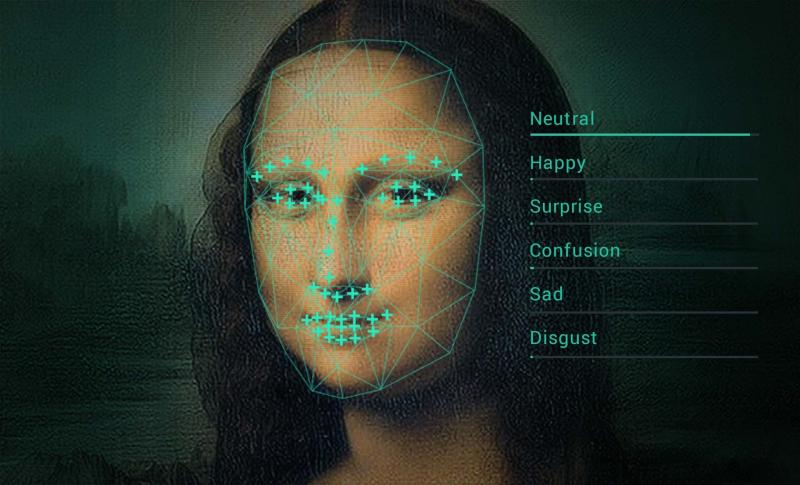

# Emotion Detection with RetinaFace and CNNs

This project captures images using a camera, detects faces using RetinaFace, and classifies emotions using deep learning models — EfficientNet and a custom CNN.

---

##  Key Features

- Real-time face detection using **RetinaFace**
- Emotion classification using:
  -  **EfficientNet (pretrained backbone)**
  -  **Custom CNN architecture**
- Lazy loading for memory-efficient training
- FER2013 dataset support
- Google Colab and webcam-ready

---

## Tools & Technologies

- Python
- TensorFlow / Keras
- OpenCV
- RetinaFace
- EfficientNet
- Matplotlib / NumPy

---

|| Through the lens of technology, we unveil identities, every pixel a whisper, every feature a story. Facial recognition is more than code; it's a dance between art and intelligence.
